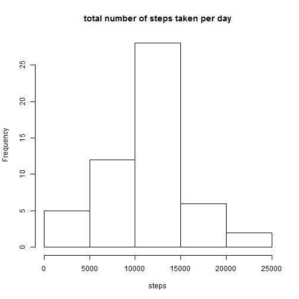
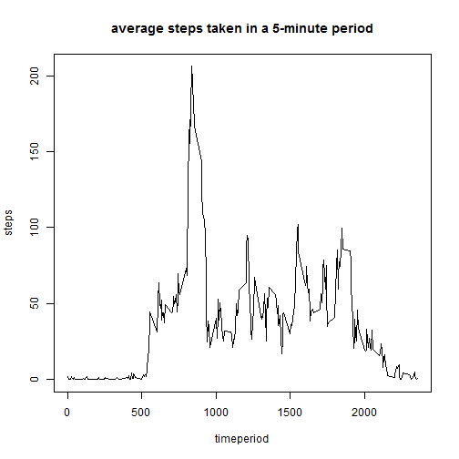
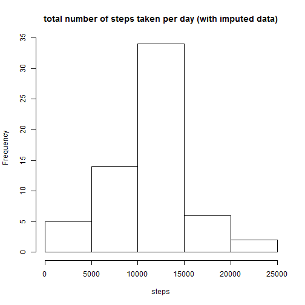
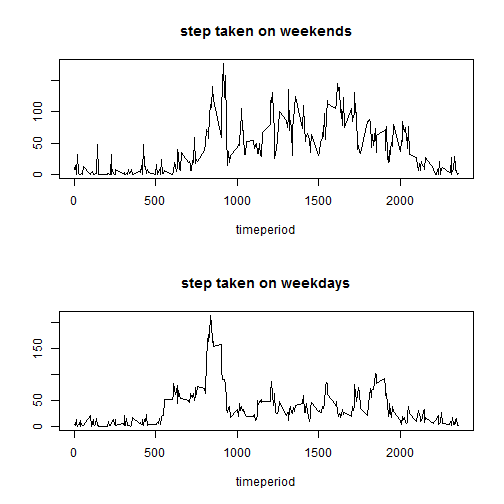

# Reproducible Research: Peer Assessment 1


## Loading and preprocessing the data

```r
data <- read.csv("activity.csv", colClasses = c("numeric", "Date", "numeric"))
data1 <- data[!is.na(data$steps),]
```

## What is mean total number of steps taken per day?

```r
histdata <- aggregate(data1$steps,by=list(data1$date),FUN=sum)
hist(histdata$x, main = "total number of steps taken per day", xlab="steps", ylab="Frequency")
```

 
### mean of total number of steps taken per day

```r
mean(histdata$x)
```

```
## [1] 10766
```
### median of total number of steps taken per day

```r
median(histdata$x)
```

```
## [1] 10765
```

## What is the average daily activity pattern?

```r
timedata <- aggregate(data1$steps, by=list(data1$interval),FUN=mean)
plot(x=timedata$Group.1, y=timedata$x, type="l", main="average steps taken in a 5-minute period", xlab="timeperiod", ylab="steps")
```

 
### Maximum number of steps in one 5-minute interval:

```r
index <- which.max(timedata$x)
print(timedata$x[index])
```

```
## [1] 206.2
```
### in the interval:

```r
print(timedata$Group.1[index])
```

```
## [1] 835
```

## Imputing missing values
### Number of missing values in the dataset:

```r
print(length(is.na(data$steps)))
```

```
## [1] 17568
```
### Creating imputed data with the mice package
The mice.impute.sample() function simply picks up an other (observed) value from the
dataset randomly.

```r
library("mice")
```

```
## Loading required package: Rcpp
## Loading required package: lattice
## mice 2.22 2014-06-10
```


```r
dataImputed<-data
set.seed(0) # must be set as the imputation method "sample" is using random numbers
dataImputed[is.na(data$steps),"steps"] <- mice.impute.sample(data$steps, !is.na(data$steps))
histdata2 <- aggregate(dataImputed$steps,by=list(dataImputed$date),FUN=sum)
hist(histdata2$x, main = "total number of steps taken per day (with imputed data)", xlab="steps", ylab="Frequency")
```

 
### mean of total number of steps taken per day (with imputed data)

```r
mean(histdata2$x)
```

```
## [1] 10778
```
### median of total number of steps taken per day (with imputed data)

```r
median(histdata2$x)
```

```
## [1] 10765
```
The medians are the same before and after imputation, but the average values are sligthly different, however the difference is only (10778-10766)=12 which is approximatly 10% of the standard deviation of the observed data, so the difference is not significant. 
## Are there differences in activity patterns between weekdays and weekends?

```r
Sys.setlocale("LC_TIME", "US") # Just for the case one runs this script on computer with different settings
```

```
## [1] "English_United States.1252"
```

```r
dataImputed$wd <- (weekdays(dataImputed$date) == "Saturday" | weekdays(dataImputed$date) == "Sunday")
plotData <- aggregate(dataImputed$steps,by=list(dataImputed$wd, dataImputed$interval),FUN=mean)


par(mfrow = c(2,1))
plot(plotData$Group.2[plotData$Group.1],plotData$x[plotData$Group.1], type="l", main="step taken on weekends", xlab="date", ylab="")
plot(plotData$Group.2[!plotData$Group.1],plotData$x[!plotData$Group.1], type = "l", main="step taken on weekdays", xlab="date", ylab="")
```

 
